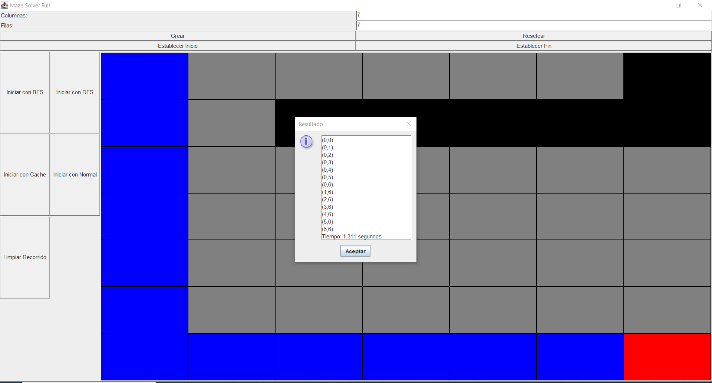

# Proyecto Final - Estructura de Datos
 

 ### Carrera: 
  **Computación**
 

 ### Materia:
 
  **Estructura de Datos**
 

 ### Nombres:

  **José Vanegas:**
  jvanegasp1@est.ups.edu.ec
 

  **Miguel Vanegas:**
  mvanegasp@est.ups.edu.ec
 

  **Ricardo Romero:**
  rromeroc5@est.ups.edu.ec

## Descripción del problema

El problema consisto en el desarrollo de la aplicación en java, implementar todo lo aprendido, implementar el mvc (Modelo,Vista, Controlador), implementación de los métodos de búsqueda, en la creación de obstáculos para poder visualizar los métodos de búsqueda que va desde el inicio al fin  y la implementación de los tiempos de cada método.

## Propuesta de solución
### Marco Teórico: 
### Dinámica:
La programación dinámica es un método para resolver problemas de programación matemática que puedan dividirse en subproblemas relacionados entre sí de forma que, resolviéndolos, podemos hallar una solución óptima para el problema original.
### BFS y  DFS: 
Algoritmo BFS (Breadth-First Search o Búsqueda en Amplitud) es otro algoritmo de búsqueda utilizado en grafos. A diferencia de DFS, que explora tan lejos como sea posible a lo largo de cada rama antes de retroceder, BFS explora los nodos vecinos del nodo actual antes de pasar a los nodos que están más lejos.

## Descripción de la propuesta de solución, herramientas y/o lenguajes que usuraron:
Los métodos largos y repetitivos se deben dividir en métodos auxiliares para mejorar la legibilidad y la mantenibilidad y usamos el lenguaje de java: Eclipse ya que conocemos mas su uso.
Las Herramientas que usamos son:

*Swing: Biblioteca de Java para crear interfaces gráficas de usuario. Utilizada para diseñar la interfaz de la aplicación, con componentes como JFrame, JPanel, JButton, etc.

*JOptionPane: Para mostrar mensajes de diálogo y notificaciones al usuario.

*Propisimos crear un mvc (Modelo-Vista-Cotrolador) para poder organizar y con eso tenemos una mejor implementación de nuestro codigo y para manejar los datos con mas eficiencia, en la parte del modelo tenemos dos ,la creacion de nuestars celda y el otro como va recorrer cada metodo de busqueda , en la parte de la vista implementamos en la vista lo que seria metodos de crear los botones los paneles donde va a interactura el usuario y  que te hacer las cedas , en el controlador 
que tendremos unos atributos de vista y modelo que va a hacer funcionas los botones con events y la creación de celdas y recorrido de los método y en la parte extra esta para limpiar el recorrido y el botón resetear que hará borrar todo la celda.

## Criterio por integrante de su propuesta

- Ricardo:Para mi un ppunto a tomar en cuenta sería separar las responsabilidades de la interfaz de usuario y los algoritmos de búsqueda.

- José: Mi criterio es que la interfaz de usuario para que sea más intuitiva y agregar pruebas unitarias garantizarán una experiencia más robusta y amigable es la funcionabilidad de la interfaz.

- Miguel: Mi criterio es en la parte de los botones de inicio y fin para mi me fue una buena idea por que como en programacion al ingersear los datos inican desde 0, por lo cual la gente no lo toma encuenta y estaria con problemas al usar nuestro aplicacion. Yo tenia pensando usar un JTextArea para mostrar las posiciones y el tiempo que tarda al recorrer cada metodo ya que se vería mejor que un cuadro de dialogo ya que siempre tengo la idea que mas se usa para errores que para que salida de información.

## Capturas de la implementación final de la UI

- - Normal:

- - Extra: 

- Recorrido por BFS

- Recorrido por DFS

- Recorrido con CACHE

- Recorrido con Normal (Recursivo)

## Conclusiones:

Para nuestras conclusiones para ver cual es mejor metodo de buqueda hicimos pruebas con tiempo de cada metodo donde el metodo BFS apreximadamente demoro 4.593 segundos , DFS demoro 4.565 segundos , cache demoro 1.311 segundos y sin cache demoro 1.306 segundos donde sabemos que:

### BFS
 BFS explora todos los nodos a un nivel antes de pasar al siguiente nivel, lo que garantiza encontrar el camino más corto en un espacio de búsqueda no ponderado.

### DFS 
El DFS explora lo más profundo posible en cada rama antes de retroceder, lo que puede ser más rápido en encontrar una solución en espacios de búsqueda profundos.

### CACHE
Muy eficiente en términos de tiempo. Reduce el tiempo de ejecución al evitar cálculos redundantes.

### NORMAL
Realiza la búsqueda de manera directa. Es más simple y puede ser más rápido en problemas pequeños.

Por lo tanto el método Cache es más rápido porque evita cálculos redundantes al almacenar resultados intermedios, lo que le permite encontrar soluciones de manera más eficiente en comparación con otros métodos.

## Consideraciones:

- Ricardo: Yo considero comentar el codigo para explicar la lógica del código para ayudar a otros desarrolladores a entender lo que hace gran parte del código.

- Miguel: Yo considero usar un menú donde haya una opción de ayuda por si el usuario no entiende como usar nuestro programa para que así pueda entender el uso del programa y explicaciones de los metodos.

- José: Yo considero que usemos el uso de la internacionalización para la utilización de usuarios de otros países y tener una interfaz más atractiva poniendo imágenes y otros componentes para nuestra interfaz.

